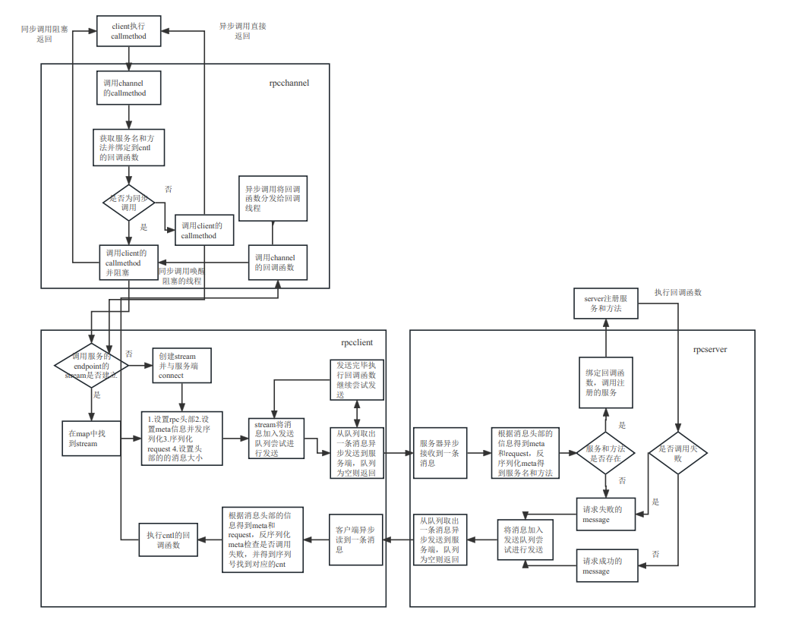
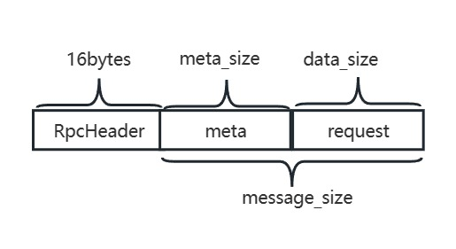
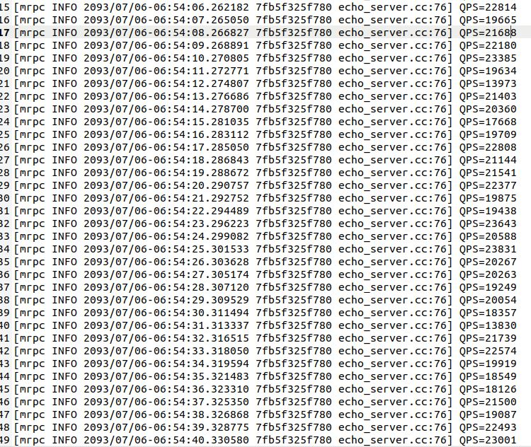

# 项目简介
1. 主要内容：基于异步网络通信库Boost::asio和序列化框架Protobuf实现的轻量级Rpc框架

2. 主要特性：

    - 支持同步和异步调用：在rpc调用前设置回调函数`done`即为异步调用，`done`为null即为同步调用，同步调用在调用结果返回前，将阻塞在`RpcChannle::CallMethod`，异步调用将`done`加入回调函数线程组异步执行。

    - 支持解析自定义协议和http协议：根据协议的头四个字节区分`Get`,`Post`,自定义协议，然后调用对应的方法进行解析。HTTP解析状态机，自定义协议解析先获取协议头部，再根据头部的`meta_size`和`data_size`解析meta信息和data信息。

    - 支持超时管理灵活控制请求时间：在Rpc调用前设置`RpcController`的超时时间，如果设置了超时时间将`RpcController`加入超时管理类，超时管理类里面维护了一个`Item`结构体的小根堆
    ```
        struct Item{
            long long expire_time;
            RpcControllerPtr cnt_;
            Item(long long time = 0, const RpcControllerPtr& cnt = nullptr)
                : expire_time(time)
                , cnt_(cnt)
            {

            }
            bool operator<(const Item& item) const 
            {
                return this->expire_time > item.expire_time;
            }
        };
    ```
    以`ROUTE_TIME`微秒为周期进行检查，当从小根堆里面取出超时的`Item`，当`RpcController`未调用`Done`函数时，将提前结束Rpc调用并设置错误为timeout(未解决的问题：可能存在多个线程对`RpcController`调用`Done`出现未定义的行为，解决办法将`Done`设置为线程安全的函数)。

    - 离散的读写缓冲区可以减少内存拷贝：Writebuf继承`google::protobuf::io::ZeroCopyOutputStream`可以分配*多块离散的内存*给protobuf message直到填满为止，可以减少内存拷贝(因为不能一开始就保证需要的目标内存有多大，这意味着不能一次性分配足够的内存空间给protobuf message序列化，可能需要将多块小内存拷贝到一块大内存中)，Writebuf包含多块小内存`Buffer`，brpc采用`ptr= malloc(size+2)`的内寸将，`ptr`设置为引用计数，`ptr+1`设置为size，返回`ptr+2`作为申请的内存地址，而我采用了在`Buffer`内维护一个`share_ptr<Buffer>`的智能指针，来管理`ptr`。

    - 支持Mock测试：如果要测试`RpcChannel`的功能，需要依赖`RpcClient::CallMethod`，而`RpcClient::CallMethod`又要依赖`RpcServer`和`RpcClientStream`，需要依赖完整的Rpc调用功能，因此为了单独测试`RpcChannel`的功能，设计了`MockTest`类，`MockTest`类为单例类，在调用`RpcChannel::CallMethod`前设置为mock调用，并注册`MockTest`的方法，那么Rpc调用将不会真正的请求服务器，而是调用`MockTest`的方法，通过构造一个虚拟的依赖项来单独测试`RpcChannel`的功能。

    - 经过大量测试验证了可靠性和稳定性，在4G2核虚拟机上Qps2w+：启动脚本文件，在脚本文件中启动3个客户端程序，客户端关闭TCP的Nagle算法，客户端每次发送1字节的数据并设置为异步调用，服务器收到1字节的数据后，回复同样的数据并将成功次数加1，统计1秒内的调用成功数作为QPS，然后统计平均的QPS。

3. 收获
    1. 学习到了Rpc调用的流程，对boost::protobuf能够进行基本的使用
    2. 学习了boost::asio异步网络通信库的使用，以及多线程异步网络编程如何处理粘包、如何避免多个线程同时对一个socket进行收发(异步调用在未调用完毕前返回)、如何用CAS实现无锁编程、如何加锁缩小临界区、如何设计一个通信协议及解析
    3. 学会了一些c++使用技巧如类型转换(dynamic_cast及static_cast等)，一些设计模式(impl模式)、如何使用虚函数避免代码冗余、c++命名规范、makefile的编写、多线程下gdb调式程序、enable_share_from_this的使用
    4. 学会如何进行读写缓冲区管理、了解了HTTP状态机
    5. 学会了gtest的使用，如何编写测试代码和Mock测试，如何编写自动测试脚本
    6. 剩余压缩相关代码、Profile、Pbjson和dynamic_channel未详细阅读

4. Todo
    - 流量管理
    - 超时连接管理
    - 多server调用
    - 支持webservice
    - 内置服务统计服务调用信息

# 项目开发遇到的问题和难点
## 难点：
1. 多线程环境下保证可靠和稳定通信的rpc系统
2. 多线程下tcp传输的粘包处理和协议解析
3. 调试困难和开发逻辑比较复杂

## 问题：
1. 在异步读写数据时会发生coredump，原因是因为异步读写`std::bind`绑定的回调函数传递的this指针，当读或写失败时会将stream关闭并在client的stream_map中删除stream即this指针指向的对象被析构了，因此当另一个读或写的回调函数被指向时，调用this的方法会产生coredump，解决办法采用`share_from_this`避免对象被提前析构。
2. 在client异步调用时，执行`google::protobuf::NewCallback`中绑定的参数为RpcController智能指针cnt_ptr的引用对象，在调用下一次callmethod时执行`cnt_ptr.reset()`，将`cnt_ptr`析构此时回调函数里的智能指针`cnt_ptr`所指向的对象被释放了，因此当上一次`Callmethod`回调函数被调用时回产生coredump。
3. 循环引用的问题资源不会被释放，显示的调用`client->Stop()`释放资源。

# 使用
以echo服务为例介绍如何使用

## 1.定义协议
```
syntax = "proto2";

package EchoTest;

option cc_generic_services = true;

// 定义请求
message EchoRequest
{
    optional string request = 1;
}

// 定义response
message EchoResponse
{
    optional string response = 1;
}

// 定义服务
service EchoServer
{
    rpc Echo(EchoRequest) returns(EchoResponse);
}
```
## 2.客户端
```
// 当回调函数被执行后request和response将不可用
void CallBack(RpcControllerPtr cnt)
{
    EchoRequest* request = dynamic_cast<EchoRequest*>(cnt->GetRequest());
    EchoResponse* response = dynamic_cast<EchoResponse*>(cnt->GetResponse());
    CHECK(request);
    CHECK(response);
    if(cnt->Failed())
    {
        LOG(INFO, "CallBack(): async call method failed error text: %s", cnt->ErrorText().c_str());
    }
    else
    {
        LOG(INFO, "CallBack(): async call method succeed response: %s sequence id = %d", response->response().c_str(), cnt->GetSequenceId());
    }
    delete request;
    delete response;
}

int main(int argc, char* argv[])
{
    MRPC_SET_LOG_LEVEL(INFO);
    if(argc != 3)
    {
        LOG(INFO, "Usage: ./echo_client ip port");
        return -1;
    }
    // 设置客户端参数
    RpcClientOptions option;
    option.work_thread_num = 4;
    // 创建client
    RpcClientPtr client(new RpcClient(option));
    // 服务端地址为address 端口为port创建channel
    std::string address = std::string(argv[1]);
    int port = atoi(argv[2]);
    SimpleChannelPtr channel(new RpcSimpleChannel(client, address, port));
    EchoServer_Stub stub(channel.get());

    RpcControllerPtr cnt(new RpcController());
    EchoRequest* request = new EchoRequest();
    cnt->SetRequest(request);
    request->set_request("request from client");
    EchoResponse* response = new EchoResponse();

    // 同步调用
    stub.Echo(cnt.get(), request, response, nullptr);
    // 同步调用将阻塞返回检查是否调用成功
    if(cnt->Failed()){
        LOG(INFO, "call method failed error text: %s", cnt->ErrorText().c_str());
    }else{
        LOG(INFO, "call method succeed response: %s", response->response().c_str());
    }
    delete request;
    delete response;

    // reset新的RpcController
    cnt.reset(new RpcController());
    // 创建request和response
    request = new EchoRequest();
    cnt->SetRequest(request);
    request->set_request("request from client");
    response = new EchoResponse();
    // 绑定回调函数
    google::protobuf::Closure* done = nullptr;
    done = google::protobuf::NewCallback<RpcControllerPtr>(CallBack, cnt);
    // 当设置了回调函数时为异步调用
    stub.Echo(cnt.get(), request, response, done);
    // 等待异步调用结束
    while(!flag)
    {
        usleep(100);
    }

    client->Stop();
    return 0;
}
```

## 3.服务端
```
// 继承proto中的服务EchoServer并重写Echo方法

class EchoServiceImpl: public EchoServer
{
public:
    EchoServiceImpl(){};
    virtual ~EchoServiceImpl(){};

    virtual void Echo(::google::protobuf::RpcController* controller,
                       const ::EchoTest::EchoRequest* request,
                       ::EchoTest::EchoResponse* response,
                       ::google::protobuf::Closure* done)
    {
        RpcController* cnt = dynamic_cast<RpcController*>(controller);
        cnt->SetSuccess("call success from server");
        response->set_response(request->request() + " from server");
        done->Run();
    }
};

int main(int argc, char* argv[])
{
    MRPC_SET_LOG_LEVEL(INFO);
    // 设置服务端的参数
    RpcServerOptions option;
    option.work_thread_num = 8;
    // 创建服务端
    RpcServerPtr server_ptr(new RpcServer(option));
    tcp::endpoint endpoint(tcp::v4(), 12345);
    EchoServiceImpl* impl = new EchoServiceImpl();

    server_ptr->Start(endpoint);
    // 注册该服务和方法
    if(!server_ptr->RegisterService(impl))
    {
        LOG(ERROR, "register service failed");
        return -1;
    }
    // 服务端启动
    server_ptr->Run();

    // 当捕捉到SigInt和SigQuit会结束调用Stop释放资源
    server_ptr->Stop();
}

```
# 设计原理
## Rpc调用调用流程


## 协议设计

```c++
#define MAGIC_STR_VALUE 1095126867u
struct RpcHeader{
    union
    {
        char magic_str[4];
        uint32_t magic_str_value; 
    }; // 4bytes
    int32_t meta_size; // 4bytes
    int32_t data_size; // 4bytes
    int32_t message_size; // 4bytes message_size = meta_size + data_size
    RpcHeader(): magic_str_value(MAGIC_STR_VALUE), meta_size(0), data_size(0), message_size(0){}
    bool Check()
    {
        return magic_str_value == MAGIC_STR_VALUE;
    }
};
```
```
message RpcMeta{
    // common part------------
    // message type
    enum Type{
        REQUEST = 0;
        RESPONSE = 1;
    }
    required Type type = 1;

    // message sequence id
    required uint64 sequence_id = 2;
    // -------------common part

    // request part----------------

    // service name and method name
    optional string service = 101;
    optional string method = 102;

    // Todo add timeout
    // optional int64 server_timeout = 103;

    // ----------------request part

    // response part----------------

    // set true if the call is failed
    optional bool failed = 201;
    
    // the error reason if the call is failed
    optional string reason = 202;

    // ----------------response part
};
```
`RpcHeader`大小为16字节，其中`magic_str`和`magic_str_value`用来区别是http协议还是自定义协议，`meta_size`为meta数据部分的大小，`data_size`为request序列化后的大小，`message_size`为meta部分和data部分的大小。


## 读写缓冲区管理
### 1.普通Buffer
普通Buffer采用类似redis字符串的设计方法，不过采用智能指针管理内存空间的释放
```
class Buffer
{
private:
    char* _data; // 裸指针
    std::shared_ptr<char[]> shared_buf_ptr; // 智能指针
    int _capacity;// 容量
    int _size;// 已使用的字节
}
```

### 3. Writebuf
Writebuf继承`google::protobuf::io::ZeroCopyOutputStream`可以分配*多块离散的内存*给protobuf message直到填满为止，可以减少内存拷贝(因为不能一开始就保证需要的目标内存有多大，这意味着不能一次性分配足够的内存空间给protobuf message序列化，可能需要将多块小内存拷贝到一块大内存中)。
```
class WriteBuffer: public google::protobuf::io::ZeroCopyOutputStream
{
public:
    WriteBuffer();
    virtual ~WriteBuffer(){};
    
    const std::deque<Buffer>::reverse_iterator GetCurrentIter();

    void SwapOut(ReadBuffer* readbuf);

    std::string ToString();
    
    int64_t Reserve(int bytes);
    
    void SetData(int head, const char* data, int bytes);
    // 继承ZeroCopyOutputStream的方法--------
    // 返回一段可写的连续内存及大小 内存buffer大小为*size，*data指向了这段内存
    virtual bool Next(void** data, int* size); 
    //归还Next申请的部分内存
    virtual void BackUp(int count);
    // 写入的字节总数
    virtual int64_t ByteCount() const;
    // --------继承ZeroCopyOutputStream的方法

    bool Extend(); // 分配新的buffer
    int TotalBytes() const;
    int BlockCount() const;

private:
    std::deque<Buffer> _buf_list;
    std::deque<Buffer>::reverse_iterator _cur_iter;
    int _last_bytes;
    int _total_bytes;
    int64_t _write_bytes;
};
```

### 2.Readbuf
Readbuf继承`google::protobuf::io::ZeroCopyInputStream`可以将从socket读到*多块离散的数据*存放在`_buf_list`中，应用端可以直接反序列化Readbuf中的*离散的数据*得到meta或request，可以减少网络层和应用层之间的内存拷贝。
```
class ReadBuffer: public google::protobuf::io::ZeroCopyInputStream
{
public:
    ReadBuffer();
    virtual ~ReadBuffer(){};
    void Clear();
    void Append(Buffer& buf);
    std::string ToString();
    ReadBufferPtr Split(int bytes);
    int GetTotalBytes();
    const std::deque<Buffer>::iterator GetCurrentIter();
    // 继承ZeroCopyOutputStream的方法--------
    // 返回一段可读的连续内存及大小 内存buffer大小为*size，*data指向了这段内存
    virtual bool Next(const void** data, int* size); 
    // The last "count" bytes of the last buffer returned by Next() will be
    // pushed back into the stream.
    // 针向后移动count字节 归还上次Next()执行的多余字节
    virtual void BackUp(int count);
    // 跳过count字节
    virtual bool Skip(int count);
    // 读取的字节总数
    virtual int64_t ByteCount() const;
    // --------继承ZeroCopyOutputStream的方法

    friend std::ostream& operator<<(std::ostream& os, ReadBuffer& buf);
private:
    std::deque<Buffer> _buf_list;
    std::deque<Buffer>::iterator _cur_iter;
    int _last_bytes; // 最后一次读取的字节数
    int _total_bytes; // 累计可读的字节数
    int64_t _read_bytes; // 已读的字节数
};
```

## 超时管理
见src/common/timeout_manager.h

# 性能测试
在4G虚拟机上，启动3个客户端和服务端，客户端发送1byte数据，服务端回复1byte数据
